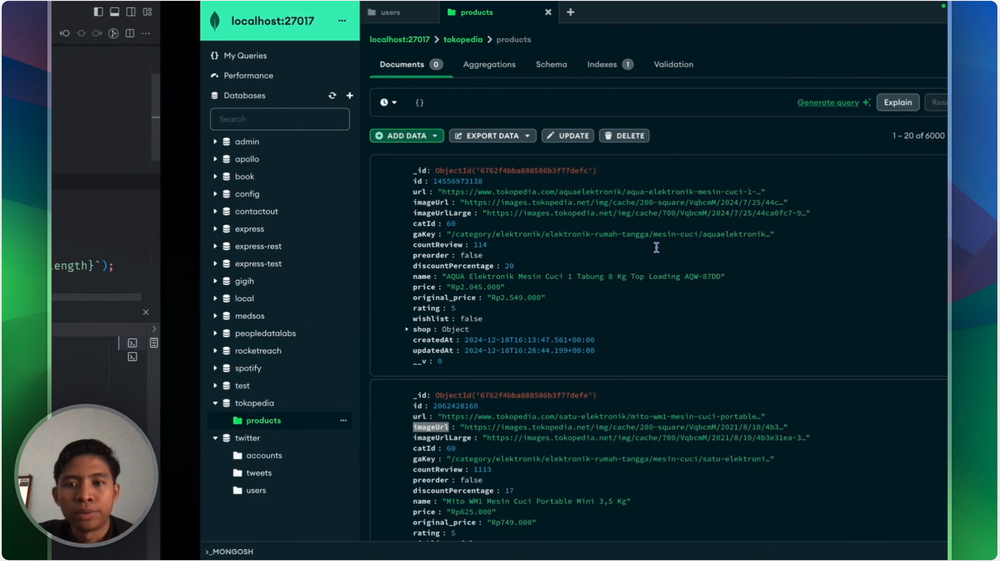

# Tokopedia Scraper Node.js

This project is a web scraper for Tokopedia, built using Node.js. It allows you to extract product information from Tokopedia. This project utilizes the Tokopedia GraphQL 

## Demo

For a detailed demonstration of how this project works, you can watch the following video:

[](https://www.tella.tv/video/scraping-data-woes-7zgo)

This video provides an overview of the project's features, setup, and usage, including a step-by-step guide on how to scrape product data from Tokopedia using this Node.js scraper.

## Features

- Scrape product details such as name, price, and rating based on category.
- Export scraped data to a CSV file.
- Handle pagination to scrape multiple pages.
- Save raw data to MongoDB using separate service via RabbitMQ.
- Error handling for rate limits and network errors with retry logic.
- Custom rate limit handler to avoid hitting the platform's rate limits.
- Resume scraping from the last saved state (last_cursor and page) stored locally in `state.json` to prevent restarting from the beginning after an interruption.
- Utilize Tokopedia's GraphQL API for faster and more sustainable scraping compared to scraping based on HTML structure.

## Need To Implement
- Add resedential proxy support
It would be better to implement proxy support using residential proxies specifically from Indonesia. This will enhance the prevention of IP blocks and rate limits due to continuous requests to Tokopedia's GraphQL API. By using residential proxies, we can distribute the IPs used for requests from various regions in Indonesia.

## Prerequisites

- Node.js (v14 or higher)
- npm (v6 or higher)
- MongoDB (v7 or higher)
- RabbitMQ (v3 or higher)
- Docker (optional)

## Installation

1. Clone the repository:
    ```bash
    git clone https://github.com/IhsanSyafiulUmam/tokopedia-scraper-nodejs.git
    ```
2. Navigate to the project directory:
    ```bash
    cd tokopedia-scraper-nodejs
    ```
3. Install the dependencies:
    ```bash
    npm install
    ```

## Configuration

The `config.js` file contains the following settings:

- `SCRAPING.MAX_RETRIES`: The maximum number of retry attempts for failed requests.
- `SCRAPING.RETRY_DELAY`: The delay (in milliseconds) between retry attempts.
- `SCRAPING.PAGE_DELAY`: The delay (in milliseconds) between scraping pages.
- `RATE_LIMITING.MAX_REQUESTS_PER_MINUTE`: The maximum number of requests allowed per minute to avoid rate limiting.
- `RATE_LIMITING.CONCURRENT_REQUESTS`: The number of concurrent requests allowed.
- `MONGODB.URI`: The MongoDB URI for connecting to the database.
- `RABBITMQ.URL`: The RabbitMQ URL for connecting to the message broker.
- `LOGGING.LEVEL`: The logging level (e.g., 'info', 'debug').
- `LOGGING.FILE_PATH`: The file path for saving log files.

## Running the Project

To run the project, follow these steps:

1. First, start the product saver service. This service is responsible for saving the scraped product data to a file. You can start it using either of the following commands:
    ```bash
    node app/services/product-saver.js
    ```
    or
    ```bash
    npm run start:product-saver
    ```
2. Once the product saver service is running, you can start the scraper to begin scraping product data from Tokopedia:
    ```bash
    npm run dev:start-scraping
    ```
3. The exported CSV file will be available in the `/output/tokopedia_{category}_products_{timestamp}.csv`.

4. If an interruption occurs during scraping, such as hitting the platform's rate limit, you can resume scraping by running:
    ```bash
    npm run dev:start-scraping
    ```
    The scraper will automatically continue from the last saved state. If you want to start scraping from the beginning, delete the `state.json` file. Note that the exported CSV will only contain data from the last saved state. For a complete CSV export, you can export the data from the MongoDB products collection.

## Deployment

You can deploy the project using Docker and Docker Compose. The repository includes a `Dockerfile`, `docker-compose.yml`, and `Makefile` to simplify the deployment process.

### Using Docker

1. Build the Docker image:
    ```bash
    make dc-build
    ```

2. Run the Docker container:
    ```bash
    make dc-run
    ```
These commands will build the Docker image, start the necessary services, and ensure the application is running in a containerized environment.

The product saver service must be running before you start the scraper to ensure that the scraped data is saved correctly.

